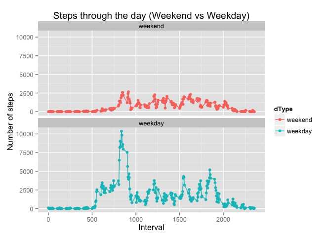

# Reproducible Research: Peer Assessment 1


## Loading and preprocessing the data
The first step in our report is to unzip the **activity.zip** file and load it into our working dataframe


```r
file <- 'activity.zip'
data <- read.csv(unz(file, 'activity.csv'))
data$date <- ymd(data$date)
```

This is the first lines of the file

```r
head(data)
```

```
##   steps       date interval
## 1    NA 2012-10-01        0
## 2    NA 2012-10-01        5
## 3    NA 2012-10-01       10
## 4    NA 2012-10-01       15
## 5    NA 2012-10-01       20
## 6    NA 2012-10-01       25
```

## What is mean total number of steps taken per day?
To answer this question we need to sum all the steps in one day.

The first step will be finding NAs

```r
valid <- complete.cases(data$steps)
```

Now we subset the dataframe and find the unique days

```r
dataDailySteps <- data[valid, ]
uniqueDays <- unique(dataDailySteps$date)
```

And finally we calculate the daily sum

```r
dailySteps <- data.frame(date=as.Date(character()),steps = numeric())
for (day in uniqueDays) {
        s <- sum(dataDailySteps[dataDailySteps$date == day, ]$steps)
        dailySteps <- rbind(dailySteps,c(day,s))
}

names(dailySteps)[1] <- "date"
names(dailySteps)[2] <- "steps"

# Format dates back as POSIXct
dailySteps$date <- as.POSIXct(dailySteps$date, 
                              origin = "1970-01-01", tz="UTC")

# Calculate mean and and median number of steps
meanSteps <- mean(dailySteps$steps)
medianSteps <- median(dailySteps$steps)
```
We can generate a histogram to show the steps distribution

```r
hist(dailySteps$steps,breaks = 10)
```

 

The mean number of daily steps is 10766.19 and the median is 10765

## What is the average daily activity pattern?
Now we will study the average steps in 5-minutes intervals.

```r
# Clean NAs - SAME DF as dataDailySteps
dataInterval <- data[valid, ] 

# Dataframe to store means
meanInterval <- data.frame(steps = numeric(),interval = integer())

# loop through intervals
for(interval in unique(dataInterval$interval)) {
        m <- mean(dataInterval[dataInterval$interval == interval, ]$steps)
        meanInterval <- rbind(meanInterval,c(m,interval))
}

# Rename columns
names(meanInterval)[1] <- "mean"
names(meanInterval)[2] <- "interval"

# Plot mean ~ interval
plot(meanInterval$mean ~ meanInterval$interval, type='l')
```

 

```r
# Max steps interval
maxS <- max(meanInterval$mean)
maxI <- meanInterval[maxS, ]$interval
```
The maximum number of steps happens in the 1705 interval where there is an average of 206.1698 steps

## Imputing missing values
First we will calculate the number of NAs

```r
sumNAs <- sum(is.na(data$steps))
```

The total number of NAs is 2304

To fill the NAs we will use the mean value for the respective interval. The first procedure will be to imput data for the missing values columns

```r
dataNA <- merge(data[!valid,],meanInterval, by='interval')
dataNA$steps <- dataNA$mean
dataNA$mean <- NULL
head(dataNA)
```
Then we merge this data with the old dataframe without the NAs

```r
data <- rbind(data[valid, ], dataNA)
```

Now we will analyse the impact of the NAs removal procedure. We will repeat the procedure from the first part of the assignment

```r
# Calulate daily sums
dailySteps.noNA <- data.frame(date=as.Date(character()),steps = numeric())
for (day in uniqueDays) {
        s <- sum(data[data$date == day, ]$steps)
        dailySteps.noNA <- rbind(dailySteps.noNA,c(day,s))
}

names(dailySteps.noNA)[1] <- "date"
names(dailySteps.noNA)[2] <- "steps"

# Format dates back as POSIXct
dailySteps.noNA$date <- as.POSIXct(dailySteps.noNA$date, 
                              origin = "1970-01-01", tz="UTC")

# Calculate mean and and median number of steps
meanSteps.noNA <- mean(dailySteps.noNA$steps)
medianSteps.noNA <- median(dailySteps.noNA$steps)

hist(dailySteps.noNA$steps,breaks = 10)
```

 

The mean number of daily steps is 10766.19 and the median is 10765 which is the same as before.

## Are there differences in activity patterns between weekdays and weekends?
First we will create a new columns

```r
# Classify as weekday or weekend
data$tDay <- ifelse(weekdays(data$date) == 'Sunday' 
                    | weekdays(data$date) == 'Saturday', 
                    'weekend', 'weekday')
data$tDay <- as.factor(data$tDay)
```
Now we calculate the sums to the create a new dataset

```r
# I will use this dataframe to store weekday/weekend interval sums
steps.interval <- data.frame(steps = numeric(),
                             interval = integer(),
                             dType = factor())

# First calcute sums for weekends intervals
f <- 'weekend'
wDay <- data[data$tDay == f, ]

f <- as.factor(f)
for (interval in unique(wDay$interval)) {
        i <- as.integer(interval)
        s <- sum(wDay[wDay$interval == interval, ]$steps)
        r <- data.frame(steps=s,interval=i,dType=f)
        
        steps.interval <- rbind(steps.interval, r)
}

# Now, calcute sums for weekdays intervals
f <- 'weekday'
wDay <- data[data$tDay == f, ]

f <- as.factor(f)
for (interval in unique(wDay$interval)) {
        i <- as.integer(interval)
        s <- sum(wDay[wDay$interval == interval, ]$steps)
        r <- data.frame(steps=s,interval=i,dType=f)
        
        steps.interval <- rbind(steps.interval, r)
}
```
Now to generate the graphic analisys we will use GGPLOT2, because it looks beter...

```r
library('ggplot2')
g <- qplot(interval, steps, data = steps.interval, 
           color = dType,
           aes(x = interval, y = steps))
g <- g + geom_line()
g <- g + facet_wrap(~ dType, nrow = 2, ncol = 1)
g <- g + labs(x = "Interval", y = "Number of steps")
g <- g + labs(title = "Steps through the day (Weekend vs Weekday)")
g
```

 

Our conclusion is that during the weekend people start to walk later and on average they walk less than during the weekdays.
